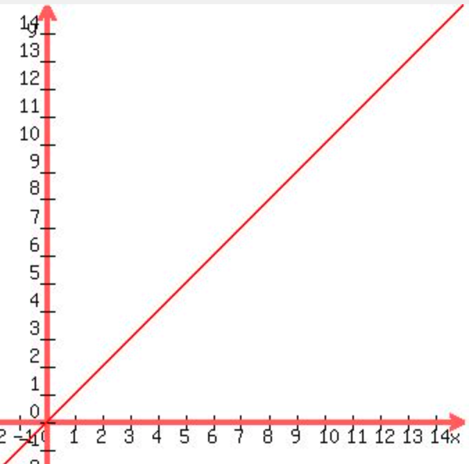

# big-o-notation

## Overview
Imagine you have an array with `n` elements, and you have some code that does something to that array. The length of time it takes the program to run might be proportional to the length of the array. If the array has 100 items, and you loop over the array 100 times, you are doing roughly 10,000 operations. Looking at Big O Notation gives you a way to classify that operation. Generally O(n) is considered okay, and O(n^2) is bad!

This might seem scary at first but really isn't too bad once you get the hang of it.

If someone asks about time complexity, they usually want you to categorize the code in one of these groups:

- O(1) - Constant time complexity
- O(n) - Linear time complexity
- O(n^2) - Quadratic time complexity
- O(log n) - Logarithmic time complexity

## Constant Time: O(1)
This is a simple operation that runs immediately, regardless of the length of the array.

```
console.log("The first item is:", items[0])
```

## Linear Time: O(n)
Imagine you have an array of numbers and you want to double each item. To do that, you would just need to touch each number once. The length of time it takes the program to run is proportional to the length of the array. 15 items means your program does roughly 15 operations.



As the length of the array goes up, the execution time goes up proportionally. 

Lets visualize that with some code:
```
let numbers = [0, 4, 10, 12]
for (let i = 0; i < numbers.length; i++) {
  numbers[i] = numbers[i] * 2
}
console.log(numbers)
```

Since we hit each item once, the execution time correspond 1-to-1 with the length of the array. This is known as linear time!

## Quadratic Time: O(n^2)
Now imagine that for some reason, you have to loop through the list completely, one time for every item in the list. That might look something like this:

```
let numbers = [0, 4, 10, 12]
for (let i = 0; i < numbers.length; i++) {
  for (let j = 0; j < numbers.length; j++) {
    const a = numbers[i]
    const b = numbers[j]
    const product = a * b
    console.log(`${a} times ${b} = ${product}`)
  }
}
```

Since that list has 4 items, and we loop over the whole list 4 times, we end up with 16 total operations (4^2). The length of time it takes to run the program is roughly proportional to the length of the array *multiplied by itself*. This is known as O(n^2). 

Generally, if you have a for-loop inside another for-loop and they both have length n, the answer is O(n^2).

## Logarithmic Time: O(log n)
The last big one to pay attention to is O(log n). Its a little trickier to explain the math behind this one, but this one applies to most algorithms that divide and conquer. 

Lets say someone picks a number at random from this list `[1, 3, 13, 43, 46, 52, 58, 63, 72]`, and you're trying to guess their number.

Mathmatically, the fastest way to pick the right number is to cut the results in half with each guess.

Start in the middle. We pick `46`. That number is too small. 

At this point, we know the number is in the list `[52, 58, 63, 72]`.

Lets cut that in half again. We guess `58`. That number is too large.

Now we know the number is `52` since thats the only thing left (smaller than `58` and larger than `46`).

The act of dividing the data set in half each time guarantees that we find a result in a certain number of guess. With 9 elements in our array, we know we'll find the answer within 4 guesses (log<sub>2</sub>(9)). For a dataset of length n, the answer will always be found within log<sub>2</sub>(n) guesses. 

The only thing you really need to remember about this one is that it applies to divide and conquer algorithms. Anything like binary search that cuts the results in half each time. 

## Final Notes
Thats pretty much it. Being comfortable with those 3 should cover you in like 99% of interview questions.

## Further Study

Some questions also ask about space complexity. This is the same premise, but they want to know how much space is required for the solution. Are you creating a full copy of the array? That would be O(n) space.

And there is one other classification of time complexity that comes up very rarely: O(n * log n). 
The premise is that you loop over the whole array, and for each item, do some kind of O(log n) operation. It comes up with partitioning and quicksort but thats about it. Its basically just as bad as O(n^2) but with extra steps, and its just slightly better.

If you want to go deeper, this article does a pretty good job covering more scenarios.
https://www.freecodecamp.org/news/big-o-notation-why-it-matters-and-why-it-doesnt-1674cfa8a23c/